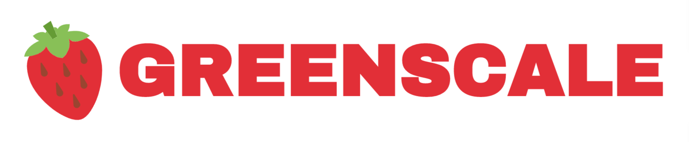

  

This IoT platform makes greenhouse monitoring has easy has ever been.
It provides smart scalability, depending on your needs. The platform provides interfaces through REST and MQTT. 
The platform also provides the end-user with data visualization and monitoring through a web application.

## Wiki

The documentation can be consulted [here](). There you will find information from first steps to system architecture design choices.

## Context

This platform was developed has the final project for the [Programming for IoT applications]() subject taught at __Politecnico di Torino__. The project took about two months of full daily work. At the starting of the project I only knew [ReactJS](https://reactjs.org/), Javascript and code based projects management skills, so all the technology user in this project was ether researched or learned in the classes.

## Status

The project is definitely __not ready for production__. The platform is incomplete and it not will be supported. There are a lot of lose ends that need to be improved and it's too much work for one person alone. Feel free to improve and contribute to the project, but take in account that this platform is public for learning purposes.

## License

__Copyright 2019 Diogo Correia__

Permission is hereby granted, free of charge, to any person obtaining a copy of this software and associated documentation files (the "Software"), to deal in the Software without restriction, including without limitation the rights to use, copy, modify, merge, publish, distribute, sublicense, and/or sell copies of the Software, and to permit persons to whom the Software is furnished to do so, subject to the following conditions:

The above copyright notice and this permission notice shall be included in all copies or substantial portions of the Software.

THE SOFTWARE IS PROVIDED "AS IS", WITHOUT WARRANTY OF ANY KIND, EXPRESS OR IMPLIED, INCLUDING BUT NOT LIMITED TO THE WARRANTIES OF MERCHANTABILITY, FITNESS FOR A PARTICULAR PURPOSE AND NONINFRINGEMENT. IN NO EVENT SHALL THE AUTHORS OR COPYRIGHT HOLDERS BE LIABLE FOR ANY CLAIM, DAMAGES OR OTHER LIABILITY, WHETHER IN AN ACTION OF CONTRACT, TORT OR OTHERWISE, ARISING FROM, OUT OF OR IN CONNECTION WITH THE SOFTWARE OR THE USE OR OTHER DEALINGS IN THE SOFTWARE.

