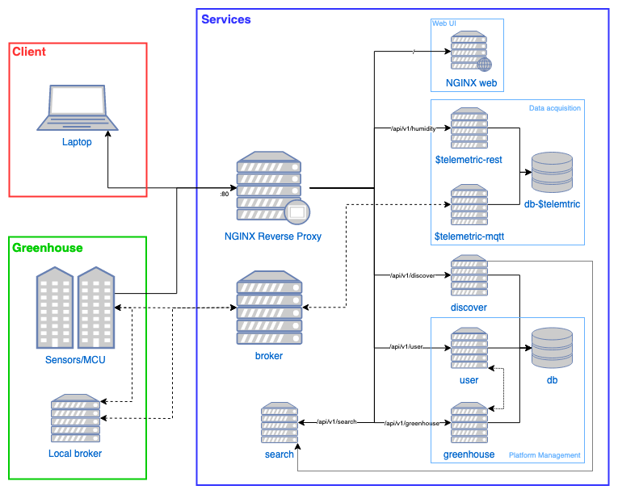

# Index

- [Getting Started](#Getting-Started)
- [System Architecture](#System-Architecture)
- [Services](#Services)
- [Test](#Test)
- [Enhancements](#Enhancements)

# Getting Started
## Introduction

This platform implements a greenhouse and plant monitoring service. The main focus is to provide __independent scalability for the different services__ in the platform to accommodate the needs of each greenhouse system. This allows a more efficient resource management and lower running costs. The platform can be reached through [REST](https://en.wikipedia.org/wiki/Representational_state_transfer) and [MQTT](mqtt.org/) interfaces. The platform also provides a web application for data visualization and monitoring.

## Dependencies

To run the platform you will need [Docker](https://www.docker.com/) installed. Docker-compose comes bundled with Docker and is tool for defining, orchestrate and running multi-container Docker applications.

## Run locally

To run on your computer, clone the repository and run docker-compose has showed bellow:

```bash
    git clone https://github.com/dvcorreia/greenscale.git
```

```bash
    cd greenscale/services
    docker-compose up --build
```

To see if is up and running you can do `docker ps` and check if all the containers are running or for a fast test is to go to `http://localhost` on your browser and see if the web application shows up.

## Run remotely

To run remotely you have to find a cloud hosting service that supports Docker applications. Follow the steps provided by your host service of choice.

# System architecture

Has said perviously, the system was design to be independently scalable. If you want to monitor more moisture sensors than humidity you can orchestrate more containers to do so. So bellow will be explained the approach taken.

## Micro-services networking


### Architecture

In the image bellow can be seen a basic illustrative diagram of the architecture scheme used in __Greenscale__. The real architecture has more services and some things might be a little different for some special cases, but is a good illustrative explanation of the platform.




### Reverse proxy and load balancing

Starting with the [NGINX](https://www.nginx.com/) reverse proxy and load balance server: any REST request that will hit one of the services need to pass through it. The NGINX looks at de url and redirects the request to the defined service.  This hides the topology and characteristics of the back-end servers by removing the need for direct internet access to them. The services on the platform are kept inside a non-public subnet and concentrate the access control on that single point. The NGINX server also allows load balancing between the services, which is useful when there's a need to scale the platform. The CORS is also done in the reverse proxy server.

### Good practices

Each service was architectured in a way that allows each one to scale independently of each other. To make this possible, some good practice rules were applied: 

- services that need to retrieve information from other services, can't send a request that will take more than 1 hop. This means that the service that will receive the request, done to the other service, can not make a request to other service. This protects the platform from infinite loops when more services are added and the full architecture of the platform is not easily precept;

- databases are only accessible through a service _(in case of the telemetric there are 2, one for REST and one for MQTT)_ that provide a public API. This ensures data security.


# Services

The platform implements multiple services which are independent. The documentation can be seen in the directory of the service of by going through the links bellow. There, you can also see the __API documentation__ for each service if there is one available.

- [broker](./../services/broker/README.md)
- [discover](./../services/discover/README.md)
- [greenhouse](./../services/greenhouse/README.md)
- [search](./../services/search/README.md)
- [telemetric-mqtt](./../services/telemetric-mqtt/README.md)
- [telemetric-rest](./../services/telemetric-rest/README.md)
- [user](./../services/user/README.md)
- [web](./../services/web/README.md)
- [event-emitter-mqtt](./../services/event-emitter-mqtt/README.md)
- [actuator](./../services/actuator/README.md)
- [warning-mqtt](./../services/warning-mqtt/README.md)
- [warning-rest](./../services/warning-rest/README.md)

# Test

The testing tools and their documentation can be check in the `./test` directory [here](./../test/README.md).

# Enhancements

The platform if far away of being ready for production. The limited human resources didn't allow a faster development and the API architecture also took a hit since the development was only done by one person and a wider planning of the platform was not made in advance.

Some things to add and enhance the platform can be seen listed bellow:

- __the most important thing that needs to be taken care is the security__. Developing the platform, in most of the cases, security was put aside to make the prototyping faster. The low knowledge about web security would mean that learning it could delay the prototype for a few more months. So adding passwords and security is the most important thing to take care;
- make a better overall API for the services: this means orchestrating better database schemas, smarter APIs and cleaner code (since it is a little "dirty" from the changes overtime during development);
- change the programming languages of the services needing high performance and speed to more performant ones like [golang](https://golang.org/) or [rust](https://www.rust-lang.org/). This will allow higher throughput with less hardware in services like the telemetrics, were publishing data from millions of sensors needs to be efficient;
- add support for [WebSockets](https://developer.mozilla.org/en-US/docs/Web/API/WebSockets_API). This will allow the web application to update in real time the graphs and give the user a better experience;
- chose better the databases for the different services.
- add support for __warnings__ and __action__ on the system. This will allow the user to be informed in case of failure or hazard events and automatic measures will be taken;
- Important is to add support for user actions on the system, like automatic irrigation, management of airflow and light, e.g.;
- clean the code of the web application and design a better. There a some components reloading that can be optimized for better performance.
- add support and boilerplate for custom services;
- make a PCB with the ESP8266 to make the system more user friendly and make the plug and play experience better.